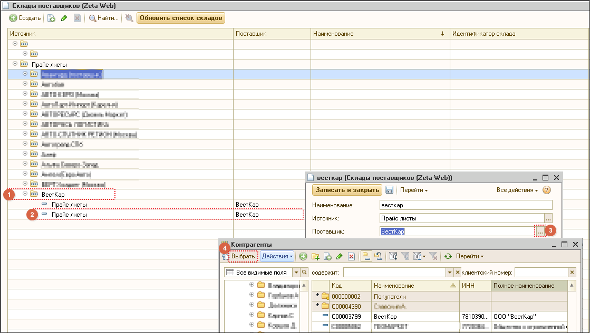
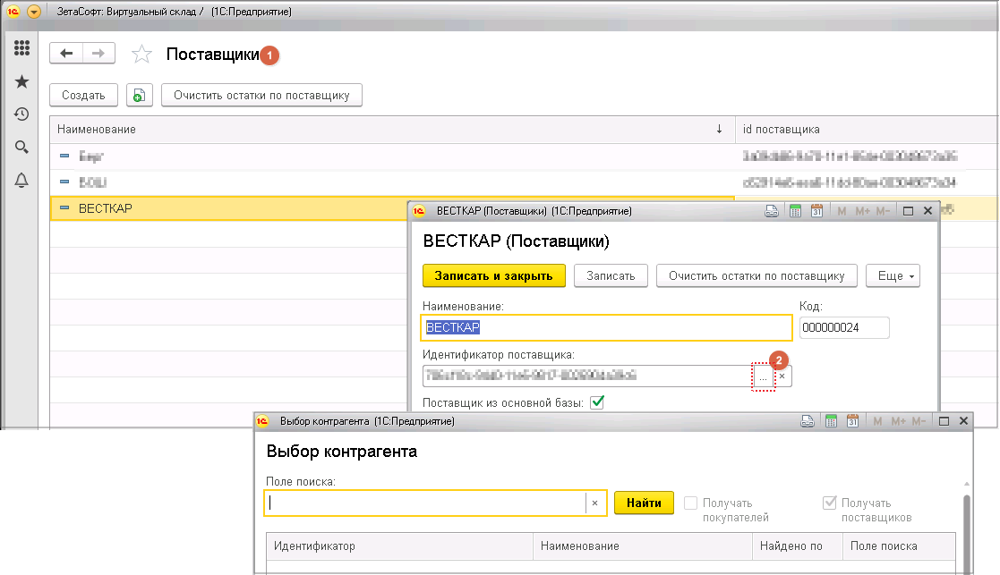

# Как правильно поменять контрагента, если изменился поставщик по настройке?

В рабочей базе УТ следует открыть справочник **Склады поставщиков \(Zeta Web → Склады \(настройка отображения\)\)**, в списке выбрать **склад** и **вручную перевыбрать поставщика** в нем.

После чего, в базе ВС открыть справочник **Поставщики** и аналогично **перевыбрать значение контрагента.**


_Допустимо также обновление контрагента в базе УТ путем:  
1. Удаления старой настройки и обновления списка складов, но в таком случае теряется связь с настройкой группы доступности складов;  
2. Запуска обработки по смене контрагента._


