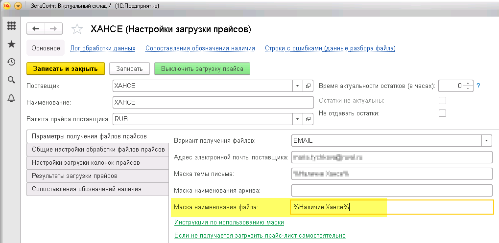
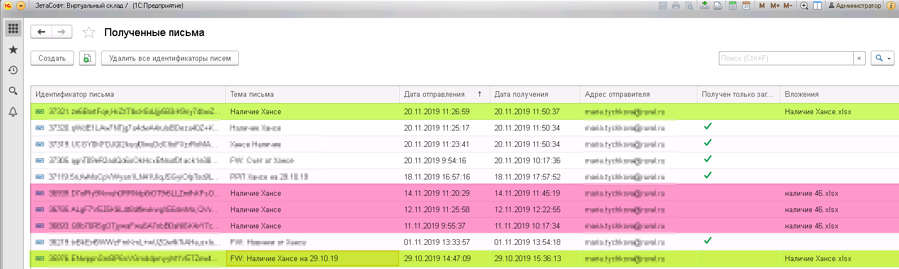
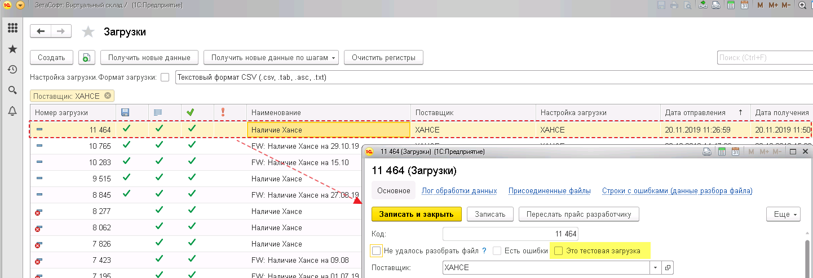

# Почему не происходит загрузка полученного прайса?

1. _**Данные наименования вложения письма не соответствуют, указанной в настройке загрузки, "Маске наименования файла"**_

Ниже рассмотрен пример.

В настройках загрузки склада указана [Маска наименования файла](https://help-vs.zetasoft.ru/nastroika-prais-lista/parametry-polucheniya-failov#parametry-polucheniya-failov) -см.рисунок ниже.

При этом в списке полученных писем видно, что некоторые **наименования вложений** не соответствуют указанному ранее параметру маски.

В списке загрузок также следует проверить прошла ли она все шаги, а также отсутствует ли внутри загрузки флаг **"Это тестовая загрузка".**

