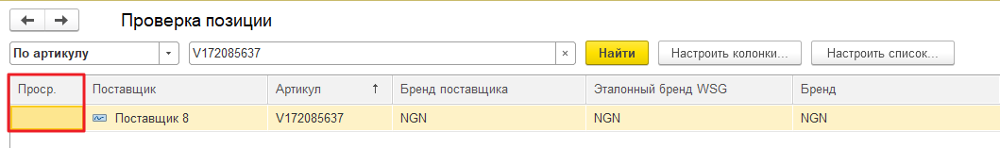

# Настройка актуальности прайс-листов

Для своевременной актуализации прайс-листов необходимо в **Настройке загрузки прайса** перейти на закладку **Расписание получения прайсов** и произвести настройку следующих параметров:

* **время актуальности остатков \(в часах\);**
* **дни, когда прайсы приходят.**

Таким образом, исходя из скриншота представленного выше, по истечению 48 часов после получения прайса, перечисленные **остатки станут не актуальными** и **перестанут отображаться на сайте.**

В случае, поиска позиции из прайс-листа, чье время актуальности истекло, в графе **"Просрочено"** об этом будет свидетельствовать наличие соответствующего флага.

