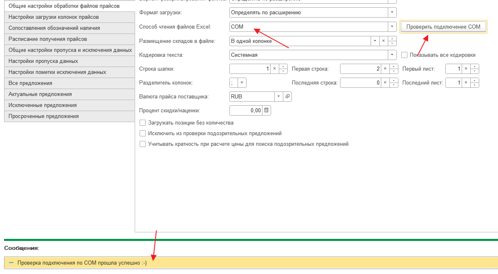

# Основные параметры загрузки

Для создания новой настройки на начальной странице выберите соответствующий пункт в правой области.

После чего откроется форма создания новой настройки.

В шапке настройки необходимо заполнить 3 обязательных реквизита:

1. Поставщик
2. Наименование настройки
3. Валюта

## Основные параметры загрузки

### Поставщик

Нажмите на выпадающий список в поле выбора поставщика.

Выберите из списка или создайте нового поставщика. Для добавления поставщика нажмите на кнопку "+".


В списке выбора отображаются последние поставщики, которые использовались в настройках прайс-листов. Для того, чтобы увидеть всех поставщиков нажмите "Показать все"


### Создание поставщика

При нажатии на "+" откроется форма создания поставщика.

Введите наименование поставщика \(как он будет отображаться в Виртуальном складе\).


Если Виртуальный склад подключен к основной базе 1С, то необходимо выбрать поставщика из основной базы.


Для выбора поставщика из основной базы нажмите на "..." в поле ввода идентификатора поставщика.

В открывшейся форме найдите необходимого поставщика и выберите его.

В результате в поле "Идентификатор поставщика" подставится уникальный код этого поставщика, а также необходимо убедиться, что установлена галка "Поставщик из основной базы"

### Наименование загрузки

Наименование загрузки может быть любым и носит информационный характер. Например, если от одного поставщика приходит несколько прайс-листов с остатками на разных складах, то мы можем указать это в названии настройки, для удобства идентификации и выбора.

### Валюта прайс-листа

Выберите валюту из выпадающего списка.

### Добавление валюты

Для добавления валюты необходимо перейти в справочник "Валюты" с помощью меню.

В открывшемся справочнике нажмите "Создать" и выберите "По классификатору".

Найдите в списке нужную валюту и выберите ее.

После добавления валюта будет доступна для выбора в настройке загрузки.

