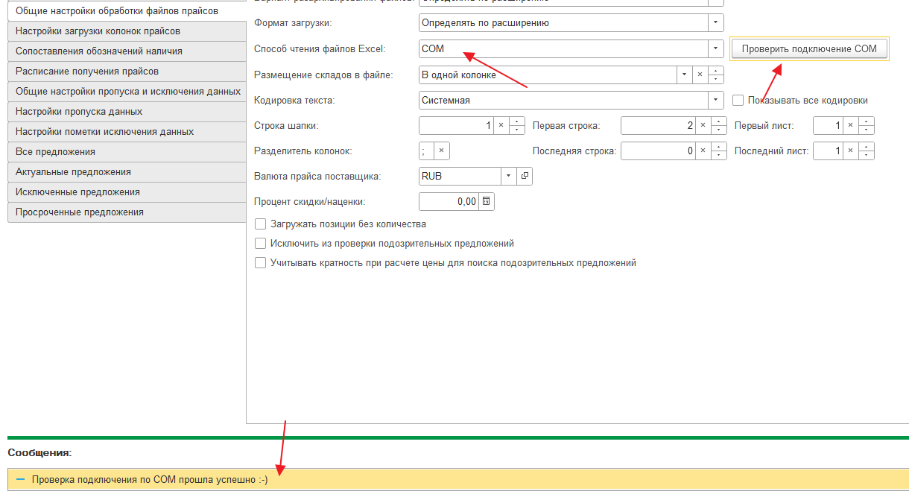

# Чтение файлов через ADO и COM

По умолчанию способ чтения файлов в Виртуальном складе - средствами платформы 1С:Предприятие. Для проверки, может ли 1С:Предприятие прочитать файл прайс-листа достаточно открыть его в Виртуальном складе через Файл - Открыть (или Ctrl + O).

Для работы с файлами, которые не читаются средствами платформы 1С:Предприятие, в типовом решении Виртуальный склад предусмотрено чтение файлов при помощи ADO и COM.

## Чтение файлов через драйвер ADO


ADO (ActiveX Data Objects) — интерфейс программирования приложений для доступа к данным, разработанный компанией Microsoft и основанный на технологии компонентов ActiveX. ADO позволяет представлять данные из разнообразных источников (реляционных баз данных, текстовых файлов и т. д.) в объектно-ориентированном виде. (подробнее по ссылке [https://ru.wikipedia.org/wiki/ADO](https://ru.wikipedia.org/wiki/ADO))


Для использования объектов ADO необходимо:

* установить на сервере, где запущена служба сервера 1С:Предприятие, драйвер баз данных Access Database Engine. Этот драйвер входит в состав программы MS Excel. Его так же можно установить отдельно, скачав инсталлятор (AccessDatabaseEngine.exe) с официального сайта Microsoft

В Виртуальном складе для подключения к ADO используется 2 строки подключения:

* СonnectionString = "Provider=Microsoft.Jet.OLEDB.4.0;Data Source= " + СокрЛП(ФайлEXCEL) + ";Extended Properties=""Excel 8.0;HDR=YES;IMEX=1;""";
* СonnectionString = "Provider=Microsoft.ACE.OLEDB.12.0;Data Source= " + СокрЛП(ФайлEXCEL) + ";Extended Properties=""Excel 12.0;HDR=YES;IMEX=1;""";

Чтение файлов через ADO реализован в Виртуальном складе в функции ЗагрузитьМетодом\_MSADODB в общем модуле ЧтениеАДО.

Проверить доступность ADO в виртуальном складе можно в любой настройке загрузке выбрав соответствующий способ чтения файлов и нажав на кнопку проверки

<figure><figcaption></figcaption></figure>

## Чтение файлов через COM

Для чтения некоторых файлов не подходит ни возможности платформы 1С:Предприятия, ни ADO. Пример таких файлов - прайс-листы в формате Excel 95 (редко, но встречаются у некоторых поставщиков).

В этом случае единственный вариант чтения такого файла - это работа с COM объектом Excel.

Для работы с COM Excel необходимо:

* установить Microsoft Excel на сервере, где запущена служба сервере 1С:Предприятие
* на том же сервере у пользователя, под которым работает сервер 1С, должны быть права на запуск службы DCOM Microsoft Excel Application

Несколько ссылок, которые могут пригодиться по настройке доступности COM:

* [https://infostart.ru/1c/articles/325873/](https://infostart.ru/1c/articles/325873/)
* [https://efsol.ru/manuals/com-object.html](https://efsol.ru/manuals/com-object.html)
* [http://pyatilistnik.org/dcom-in-excel-application/](http://pyatilistnik.org/dcom-in-excel-application/)

Чтение файлов через COM реализован в Виртуальном складе в соответствующих функциях и процедурах в общем модуле ЧтениеCOMExcel.

Проверить доступность COM в виртуальном складе можно в любой настройке загрузке выбрав соответствующий способ чтения файлов и нажав на кнопку проверки

<figure><figcaption></figcaption></figure>
