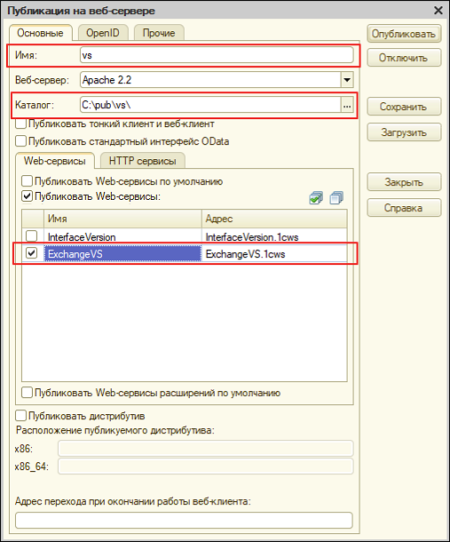

# Публикация сервисов

## Публикация web-сервиса ExchangeVS и http-сервиса ExchangeVS <a id="publikaciya-veb-servisa"></a>

В зависимости от того, какой программой вы будете пользоваться для публикации веб-сервиса, воспользуйтесь соответствующей инструкцией.


Дистрибутив Apache - [https://drive.google.com/open?id=0B1XBNSCvmVxwcUxwTFpMejRXTjg](https://drive.google.com/open?id=0B1XBNSCvmVxwcUxwTFpMejRXTjg)​


### Apache или IIS <a id="apache-ili-iis"></a>


Для публикации веб-сервиса необходимо запускать 1С в режиме **Конфигуратор** с правами администратора.



* После объединения и обновления необходимо опубликовать веб-сервис. Для этого переходим в Администрирование – Публикация на веб-сервере


* В открывшемся окне необходимо указать имя базы \(только латинские буквы, также можно использовать символ «-» и «\_»\), каталог и выставить галки как показано на рисунке. Нажмите «Опубликовать»


Web-сервис ExchangeVS и http-сервис ExchangeVS необходимы для взаимодействия с решениями [Zeta РММ](https://www.zetasoft.ru/products-zeta-rmm/) и [Zeta Web](https://www.zetasoft.ru/products-zetaweb/).





### 1С Публикатор <a id="1s-publikator"></a>

* Скачайте 1С Публикатор \(по ссылке [https://drive.google.com/open?id=0B1XBNSCvmVxwbXhTc045Nk5JakE](https://drive.google.com/open?id=0B1XBNSCvmVxwbXhTc045Nk5JakE)\) и извлеките из архива.
* Путь к папке, в которой находится 1С Публикатор, должен содержать только латинские символы, желательно расположить в корневой папке диска С \(например C:\Publicator\)


* Запустите приложение publicator.exe
* После успешного запуска вы увидите сообщение


* Нажмите на сообщение или правой кнопкой на появившийся ярлык в области уведомлений и выберите “Панель управления”


* В браузере откроется страница управления 1С Публикатором, для начала работы необходимо принять Лицензионное соглашение
* Нажмите “Опубликовать” или “1С: Публикатор”, для того чтобы перейти к списку баз


* В появившемся списке баз выберите необходимую базу, для которой вы хотите опубликовать веб-сервисы и нажмите на переключатель рядом с ней


* В открывшемся окне выберите версию платформы, под которой необходимо выполнить публикацию и нажмите “Опубликовать”. Если вы планируете работать в локальной сети, то выберите IP адреса для публикации.


* После успешной публикации скопируйте адрес публикации выбранной базы, для того чтобы увидеть список адресов нажмите на ярлык справа от названия базы


* Используйте данный адрес для дальнейших настроек

После произведения публикации рекомендуется также произвести _**проверку текста публикации vrd:**_

```text
<?xml version="1.0" encoding="UTF-8"?>
<point xmlns="http://v8.1c.ru/8.2/virtual-resource-system"
  xmlns:xs="http://www.w3.org/2001/XMLSchema"
  xmlns:xsi="http://www.w3.org/2001/XMLSchema-instance"
  base="/vs-to"
  ib="Srvr=&quot;mars&quot;;Ref=&quot;vs-to&quot;;">
 <httpServices publishByDefault="false">
  <service name="ExchangeVS"
    rootUrl="ExchangeVS"
    enable="true"
    reuseSessions="dontuse"
    sessionMaxAge="20"
    poolSize="10"
    poolTimeout="5"/>
 </httpServices>
 <standardOdata enable="true"
   reuseSessions="autouse"
   sessionMaxAge="20"
   poolSize="10"
   poolTimeout="5"/>
 <ws>
  <point name="InterfaceVersion"
    alias="InterfaceVersion.1cws"
    enable="false"
    reuseSessions="dontuse"
    sessionMaxAge="20"
    poolSize="10"
    poolTimeout="5"/>
  <point name="ExchangeVS"
    alias="ExchangeVS.1cws"
    enable="true"
    reuseSessions="dontuse"
    sessionMaxAge="20"
    poolSize="10"
    poolTimeout="5"/>
 </ws>
</point>
```

